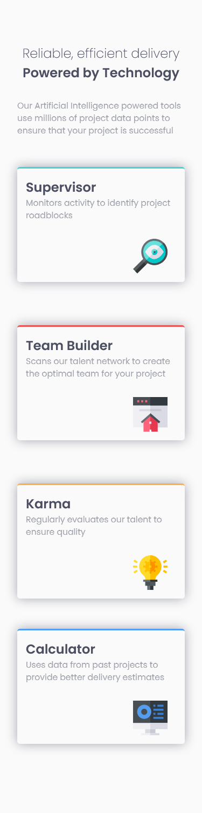

# Frontend Mentor - Four card feature section solution

This is a solution to the [Four card feature section challenge on Frontend Mentor](https://www.frontendmentor.io/challenges/four-card-feature-section-weK1eFYK). Frontend Mentor challenges help you improve your coding skills by building realistic projects. 

## Table of contents

- [Overview](#overview)
  - [The challenge](#the-challenge)
  - [Screenshot](#screenshot)
  - [Links](#links)
- [My process](#my-process)
  - [Built with](#built-with)
  - [What I learned](#what-i-learned)
  - [Continued development](#continued-development)
  - [Useful resources](#useful-resources)
- [Author](#author)
- [Acknowledgments](#acknowledgments)

## Overview

### The challenge

Users should be able to:

- View the optimal layout for the site depending on their device's screen size

### Screenshot

### Links

- Solution URL: [Repo](https://github.com/sedaryildirim/four-card-feature-section)
- Live Site URL: [Github Pages](https://sedaryildirim.github.io/four-card-feature-section/)

## My process

Started with mobile first with all sizes i needed in sizzy so i can watch as i code with how the layout changes, use grid guides as listed below to help me better understand grid concepts as first building a layout without flexbox

### Built with

- HTML5 
- CSS custom properties
- CSS Grid
- Mobile-first workflow
- Sizzy

### What I learned

How to use grid by it self, how divs can take multiple rows/columns in a grid layout and how to position elements.

### Continued development

Change tablet layout in portrait mode.

### Useful resources

- [Grid Lay It Out](https://grid.layoutit.com/) - This helped me understand how grid works and how divs can take multiple rows/colums when creating a layout
- [Malven Grid](https://grid.malven.co/) - Helped with grid layouts and positioning

## Author

- Website - [Add your name here](https://www.your-site.com)
- Frontend Mentor - [@sedaryildirim](https://www.frontendmentor.io/profile/sedaryildirim)

## Acknowledgments

[Frontendmentor.io](https://www.frontendmentor.io/)

[Malven Grid](https://grid.malven.co/)
